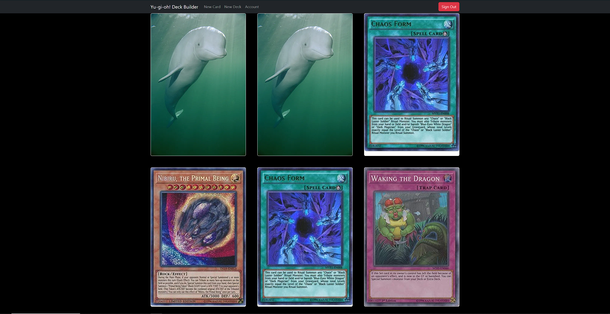
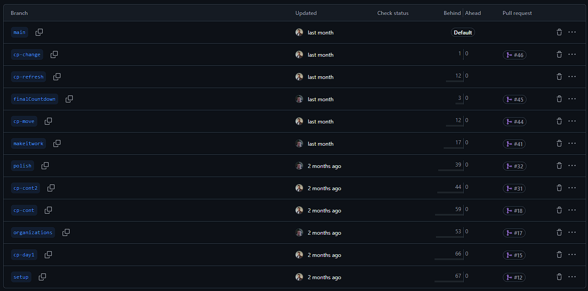
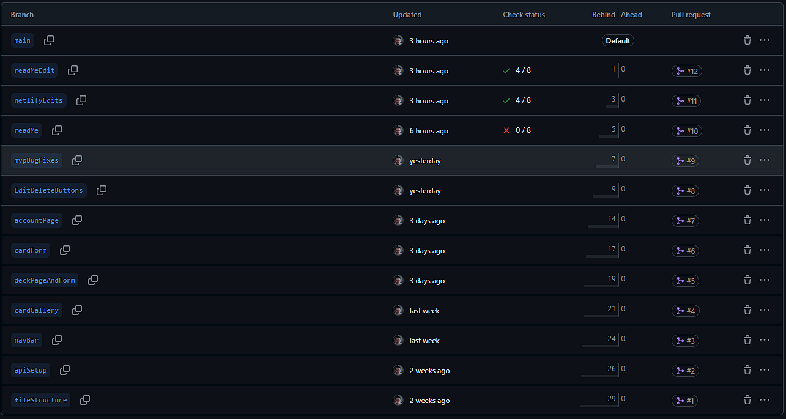
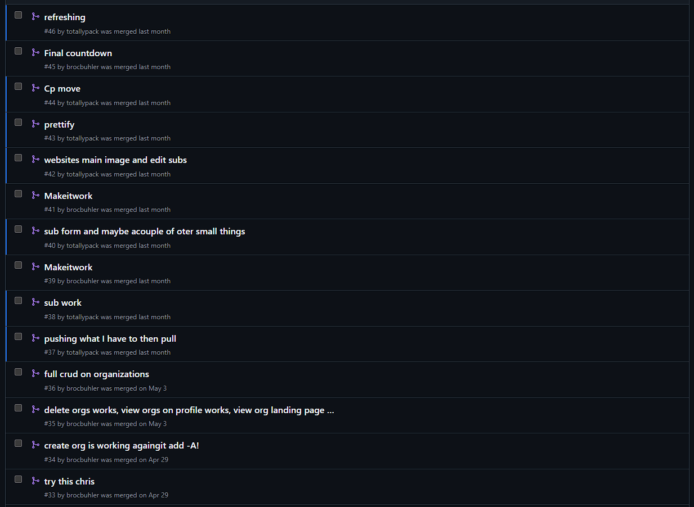
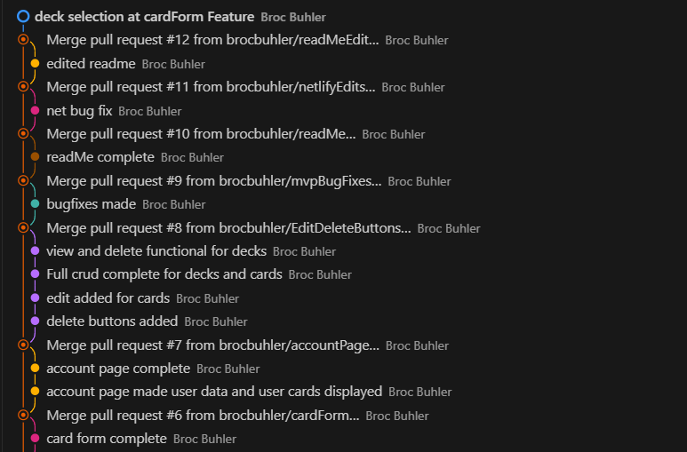
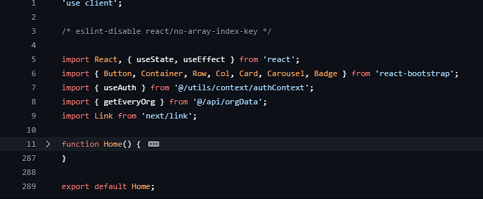
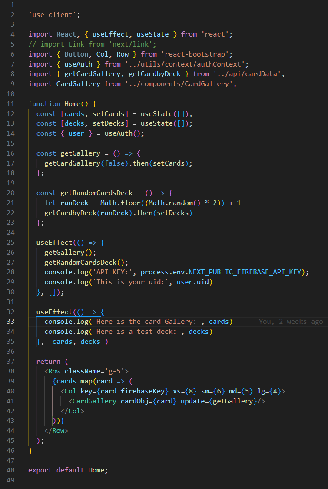

# Welcome to Yu-Gi-Oh! Deck Builder

This website will help impower your deck building journey!!
With YGO deck builder you can create a deck add to it, create cards and view edit and delete both cards and decks with ease.

# Wireframe

https://www.figma.com/board/bmG7FwbZz6eXoqvR3pDCQs/YGO-DB-wireframe?node-id=1-21&t=OhY4xhsJX4tRrNru-0

# Checkout the website!!

[Checkout the website!!](https://ygobuilder.netlify.app/)

# Checkout my feature progress

https://github.com/users/brocbuhler/projects/3

# Who is this for?

This is for the YGO card hobbies who wants to put together decks with ease withour having to pay the insane rates for cards. With this website you can plan out your decks before buying

# Features

-View cards avaliable to add to your deck
-Create a deck with a title and description
-View, edit and delete your deck and the cards in it
-Make your own fanmade cards
-View your fanmade cards and your decks on your account page
-Edit made cards
-Add your fanmade cards to your deck

# Screenshots

# How I've grown from this project

Before:

What feature is make it work? or finalCountdown
After:

I now code each branch as a feature

Before:

What does try this chris mean?
After:

I now commit useful measages that tell me what I was working on with that submit

Before:

289! on a simple home page
After:

Most of my logic now stays in my components and my pages are for displaying that logic and dynamically updating it

# Contributors

ME
https://github.com/brocbuhler

# Loom

https://www.loom.com/share/89479cc63c8a432fa012185bf02171f3
